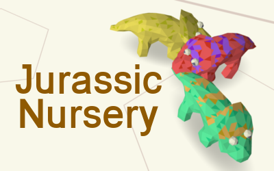
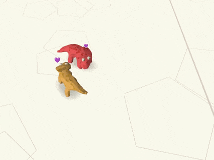

[](https://github.com/Platane/jurassic-nursery/actions/workflows/main.yml) [](https://platane.github.io/jurassic-nursery/bundle.zip)

Pet and feed adorable triceratops.

If you feed them well they might reproduce. Would you be able to breed a golden one ?

- 🦎 [play](https://platane.github.io/jurassic-nursery/)
- 🏆 or go to the [js13k entry page](https://js13kgames.com/entries/jurassic-nursery)
- 📓 read the [postmortem](./doc/postmortem/index.md)

# Screenshots

[](./doc/postmortem/images/eat.mp4)
[](./doc/postmortem/images/mate.mp4)
[](./doc/postmortem/images/pick.mp4)

_Adorable, I know_

# Usage

```sh

bun install


npm run dev


# needs advzip
npm run build

```

# TODO

- [x] color pattern
- [x] triceratops ray collision
- [x] walk to a point
- [x] restrict playground, allows to have a spot for
  - secure food
  - drop triceratops
- [x] collision avoidance
- [x] restrict camera movement (pan only ? two finger on mobile and pan on mouse hover edge on desktop )

- [ ] react to mouse movement, fruit pick up ect ..
- [ ] trees
- [ ] bones on trees
- [ ] ui select triceratops
