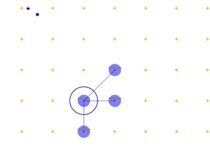
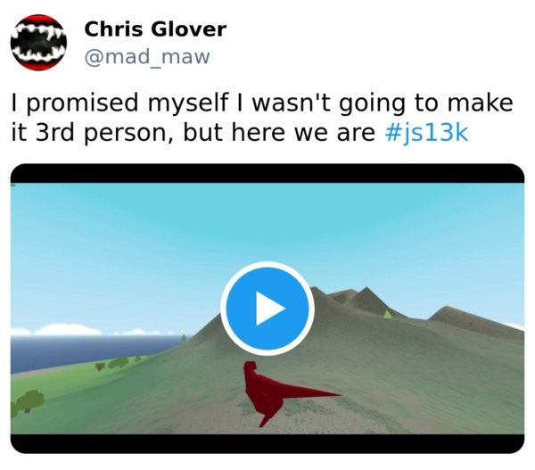
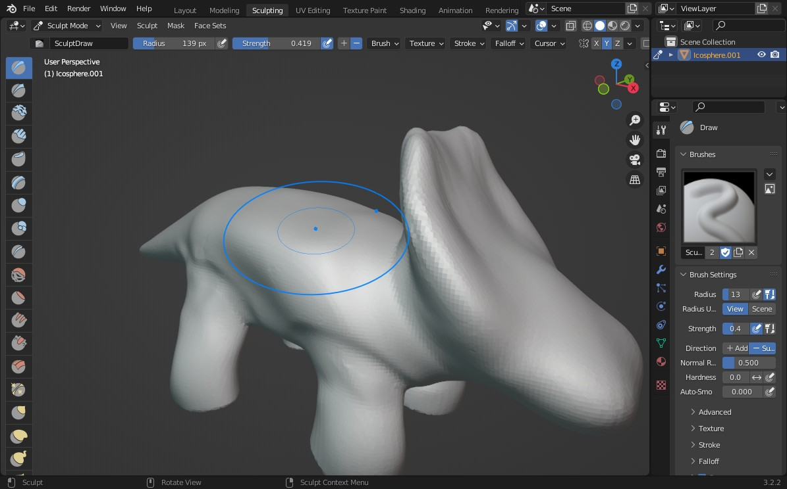
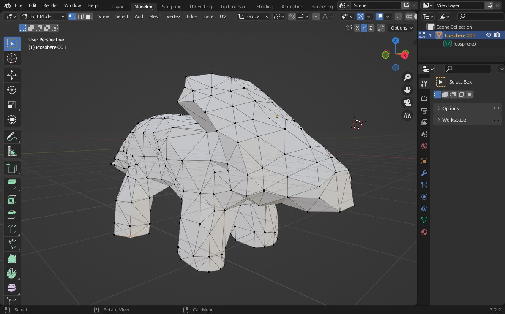
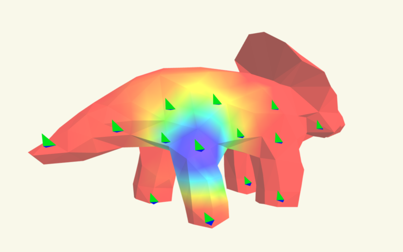
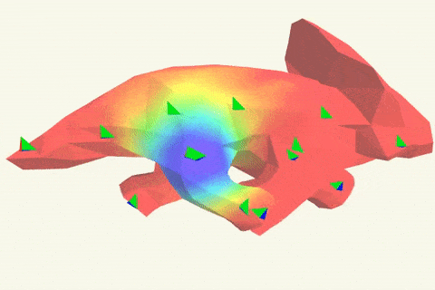
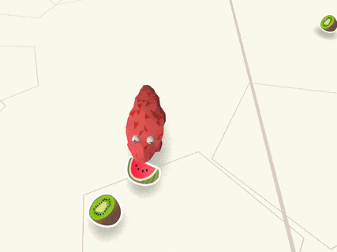
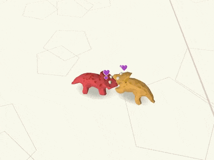
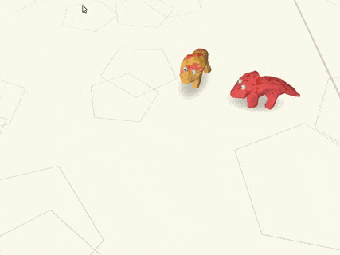
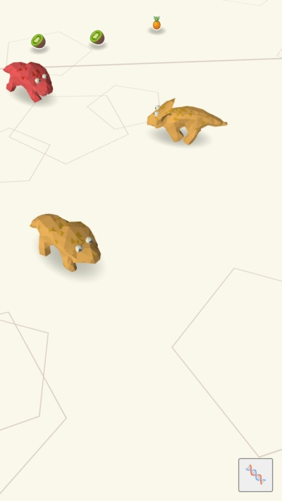

# Jurassic Nursery Post-mortem

This is a postmodern post for a game I wrote for the 13kjs 2023 competition.

# Summary

- [Inspiration](#inspiration)
  - [Goals](#goals)
  - [Dead-end](#dead-end)
  - [Why not dinosaur ?](#why-not-dinosaur)
  - [Tamagotchi and breeding](#tamagotchi-and-breeding)
- [Graphic](#graphic)
  - [Modeling](#modeling)
  - [Compressing the model](#compressing-the-model)
  - [Skinned mesh](#skinned-mesh)
- [Gameplay loop](#gameplay-loop)
  - [Triceratops IA](#triceratops-ia)
  - [Controls](#controls)
  - [Camera](#camera)
- [Tooling](#tooling)
  - [Building](#building)
  - [Continuous integration](#continuous-integration)
  - [Compressing](#compressing)
- [General Improvements](#general-improvements)

# Inspiration

## Goals

The last two years, I had a lot of fun making 3d rendering with webgl.

Before the theme announcement, I was exited to improve on my 3d skills again.

## Dead-end

The theme this year was 13th century. I thought the rise of Ghenkis Khan to be a great set up and started brainstorming.

I had this idea of a RTS where users were insensitive to adopt nomadic a style by moving caravans of resources when farm dries up. Which could lead to interesting gameplay with raids, diversion ect...

I started working on it, gameplay first with a crude 2d canvas renderer.

After some hours of work, it hits me. I was never going to finish this game. Not the way I wanted. It became clear that I will not be able to implement a pretty renderer for a lack of time / space, nor that I will be able to implement an IA the user can play against for a lack of skill.

So I scratched that.

## Why not dinosaur ?

I was looking for ideas to restart, ideally something simple where I could have fun with webgl rendering.

Then I saw a tweet by a fellow js13k creator.

Well yes I too want to abandon the theme and do a free roaming dinosaur game. (Except not really, its is about a 13th century dragon, so it works)

## Tamagotchi and breeding

**Simple gameplay**

Since I want to focus on rendering and animation details. Let's keep the gameplay simple.

A tamagotchi seemed simple enough: you feed and pet your dinosaur multiple times a day to keep him happy (and alive).

**Breeding**

With the planned webgl renderer it will be possible to draw a lot of entities, so having more than one dinosaur will be a nice showcase.

I took inspiration from an aspect of an old game I used to play: breeding dragoturkey in [Dofus](https://www.dofus.com/en/mmorpg/encyclopedia/mounts/19-dragodinde-pourpre). Those are pets that have needs to fullfil, as tamagotchis do, and can be breed.

I like that you have "recipes" to make a new pet: a golden-almond and ginger-almond can produce an indigo one for example.

**Free range**

What I like less is fences and tightly parked pets.

I would prefer for mines to roam freely.

# Graphic

This year, I wanted to experiment with skinned meshes and animations. This part focus on implementation.

## Modeling

I am absolutely not a 3d artist. However this is how I created the triceratops model:

I started by sculpting a potato, then reducing the face count with the decimation tool first and adjusting by removing / merging vertices.

## Compressing the model

This is how the model is stored:

- The bounding box of the mesh is computed.
- for each vertices, the position is normalized to fit a 255x255x255 bounding box. Each coordinate is then rounded, so it nicely fits in a uint8.
- the mesh is stored as list of triangles ( 3 vertices for each triangle ) in a Uint8array.
- it is saved as binary data, ready to be imported with a fetch call.

> improvements:
>
> I could have taken advantage of the symmetry of the mesh and potentially use half of the space.
> Unfortunately I failed to create a nice seam in blender.
>
> Storing the mesh as [triangle strip](https://en.wikipedia.org/wiki/Triangle_strip) could have save some space.

## Skinned mesh

**skeleton**

The walk animation is procedural, and the skeleton is defined at runtime.

I could have made the bones in blender and find a way to expose them, but it was easy enough to fine tune the value "manually" in the script.

I followed the article on [webgl2fundamentals.org](https://webgl2fundamentals.org/webgl/lessons/webgl-skinning.html) which is honestly a gold mine. The shader implementation was less painful than I anticipated. One of the hard part was to compute the vertex weight in a satisfying manner.

**animation**

For simplicity, there are a few params which determine the pose of the skeleton.

- position / size / direction of the mesh
- direction ( as quat ) of the tail
- direction ( as quat ) of the head
- for each leg, a value between -1 and 1. _At 0 the leg is straight, -1 the leg is pointing backward, 1 the leg it pointing forward._
- for each eye, a rotation ( as quat )

Those params are mixed depending of the triceratops velocity and angular velocity to produce the walk / run animation.

# Gameplay loop

## Triceratops IA

**eating**

Triceratops need to eat. Naturally they will try to swallow any fruit that they encounter. But only one kind of fruit is suitable for a triceratops variant. It will spit out fruit that it can't eat.

**mating**

After three lunches, the triceratops no longer want to eat. It is looking for a mate.

**birth**

They will run together for a bit and then produce a new one, getting hungry again in the process. The new one will be of the variant of one of its parent, or a new variant if its parent are part of a special recipe.

## Controls

As the user, you can drag and drop fruits for the triceratops to feed. The fruits fall outside the playground where the dinosaurs roam so you have to intervene.

You can also drag and drop dinosaur. By doing so you constraint them to roam in a specific zone. It's useful to separate them and select which ones should mate.

## Camera

I wanted my game to be played in mobile and desktop.

I struggle a bit to have controls that don't conflict to much with drag and drop. At first you could freely rotate with one finger in mobile, which was very annoying when picking small fruits.

I decided to have a fixed camera angle on mobile: Touch actions with one finger are reserved to drag and drop entities and two finger can pan / zoom.

After all, I think the camera works ok in desktop, but for mobile the vertical viewport can truncate the world in frustrating ways.

# Tooling

## Building

I brought my usual setup, it relies on esbuild to transpile the source, rollup to bundle nicely and a pass of various dubious optimizations.

In dev mode, a server watch file change, rebuild and serves the assets. Nothing too fancy.

## Continuous integration

On each commit, I run the js13kgame validation bot from [github action](../../.github/workflows/main.yml#L58-L60). To be honest it's more to test the bot than my game.

## Compressing

At some point I was dangerously reaching the 13k limit with so much features missing.

Fortunately I had forgotten the existence of [roadroller](https://github.com/lifthrasiir/roadroller) and once I added it to the build chain it did its magic and left me with plenty of space.

# General Improvements

Here are a list of feature I would have added if time nor space ( nor motivation ) were constraints.

**Proper UI**

- On triceratops selection, display a card with the triceratops name and it's genealogical tree.

- Some hints on how the controls work.

**Better environment**

A less boring playground, with trees and other flora elements. It could be pretty to animate a skinned tree to react to wind / mouse hover.
